# ec2azha
ec2azha : Stabilization System | HA, Availability Zones, EC2, AWS Global Infrastructure |

## Objectives
- Implement Amazon EC2 instances cross multiple Availability Zones for High Availability (HA)

## Deploy Stabilization System (Multiple AZ)

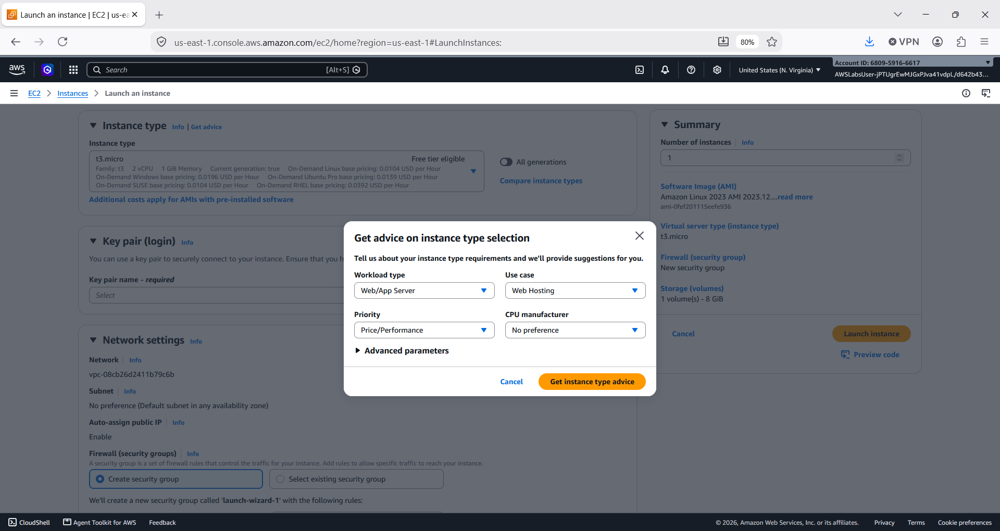

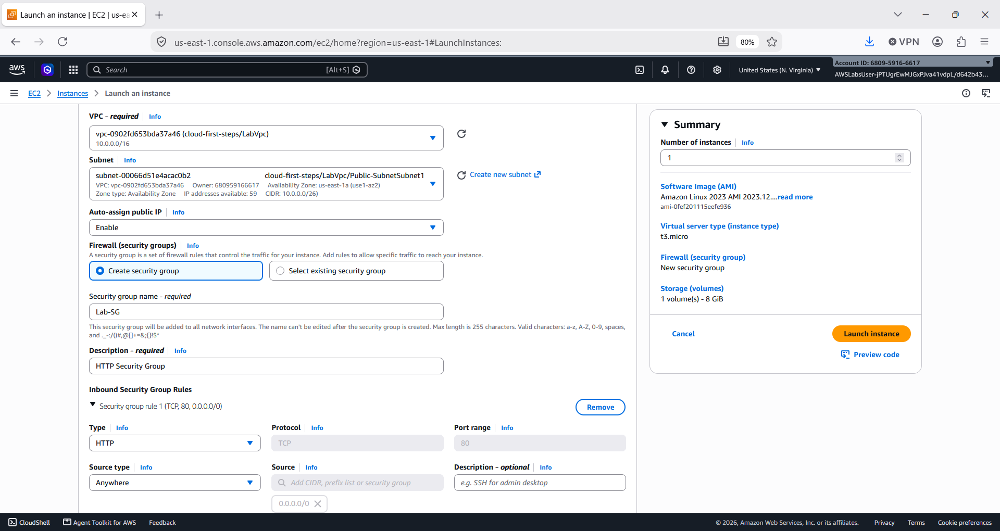

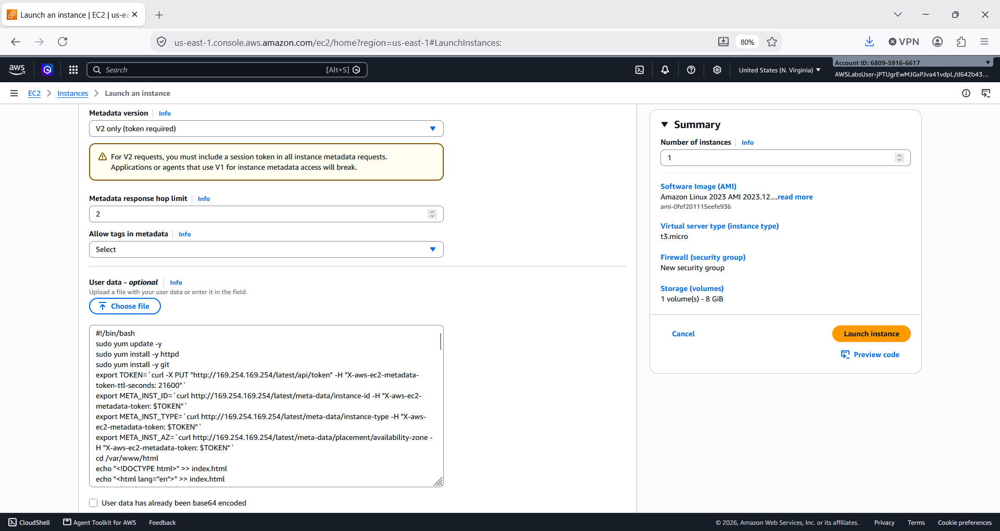

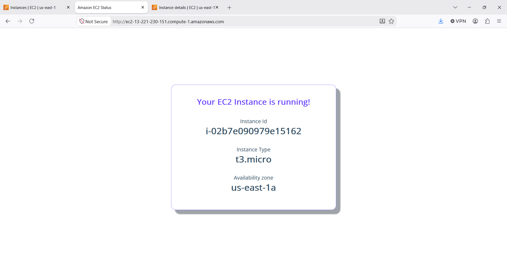

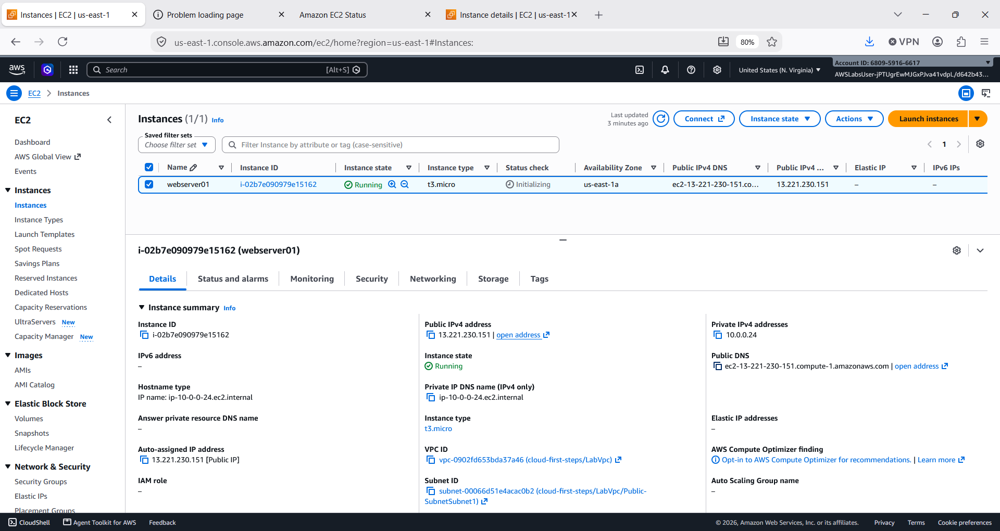

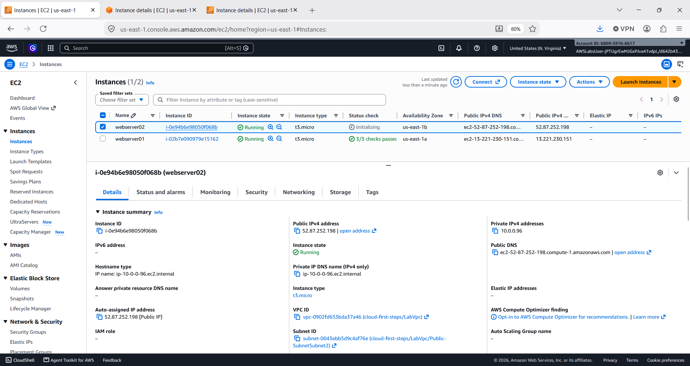

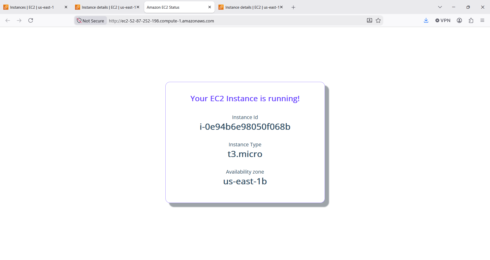

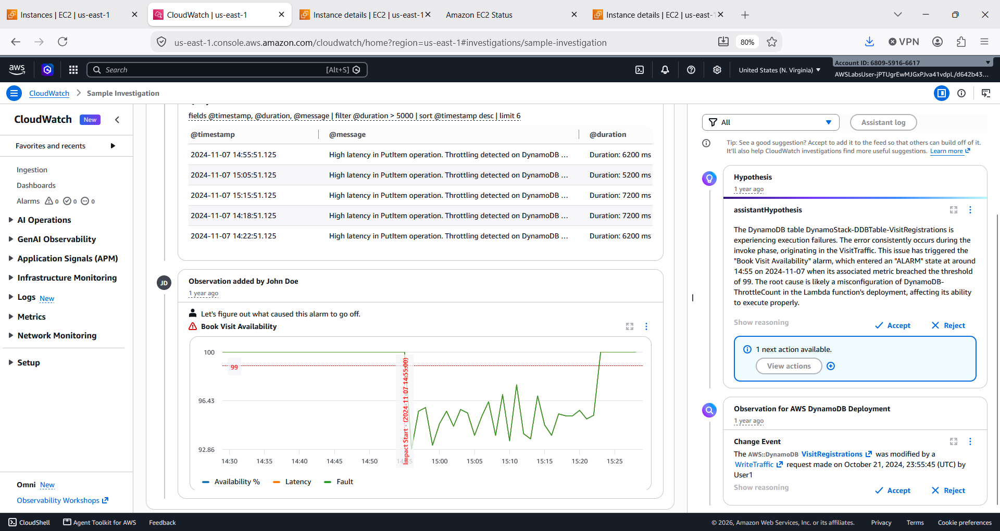

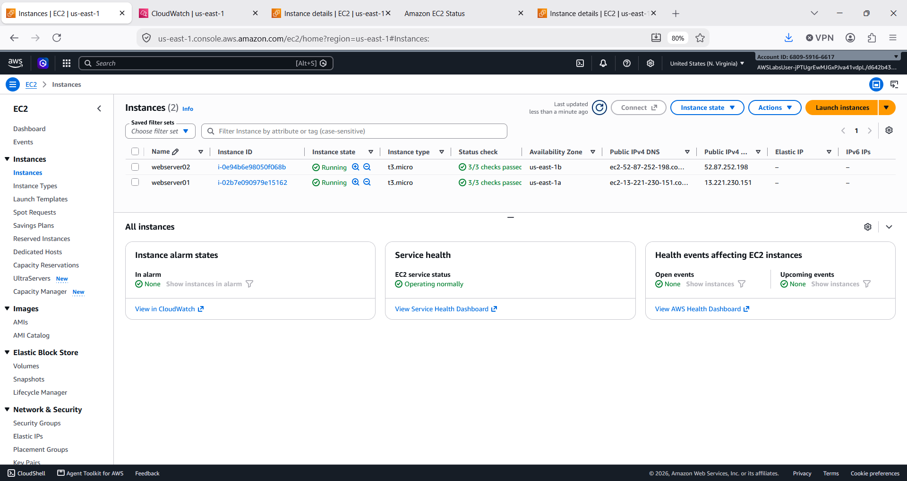

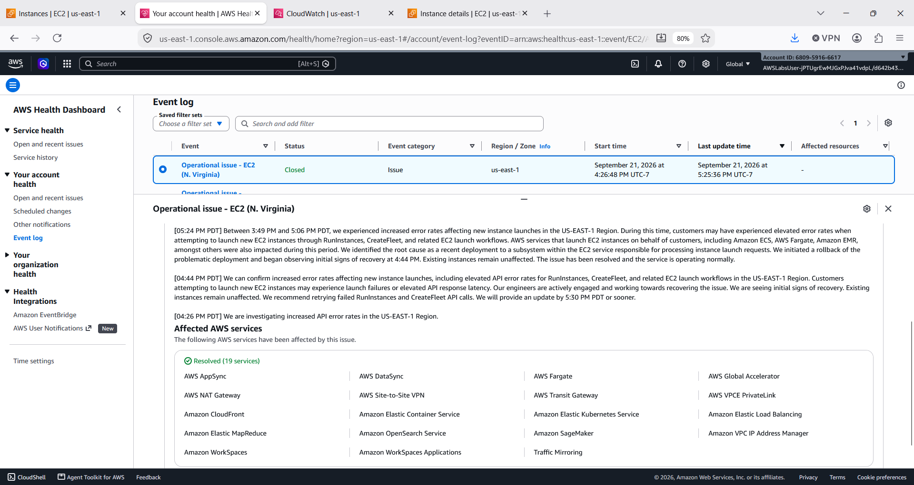

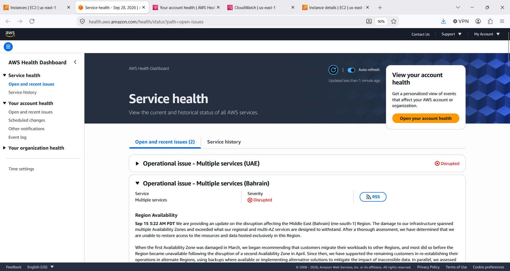
